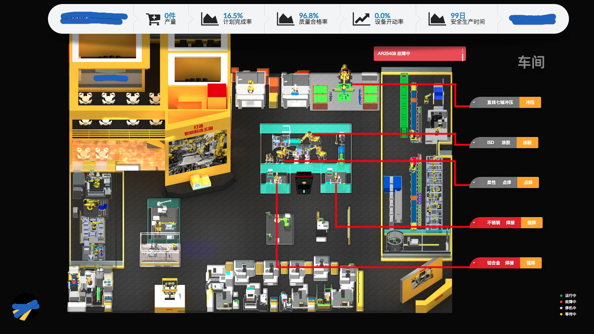
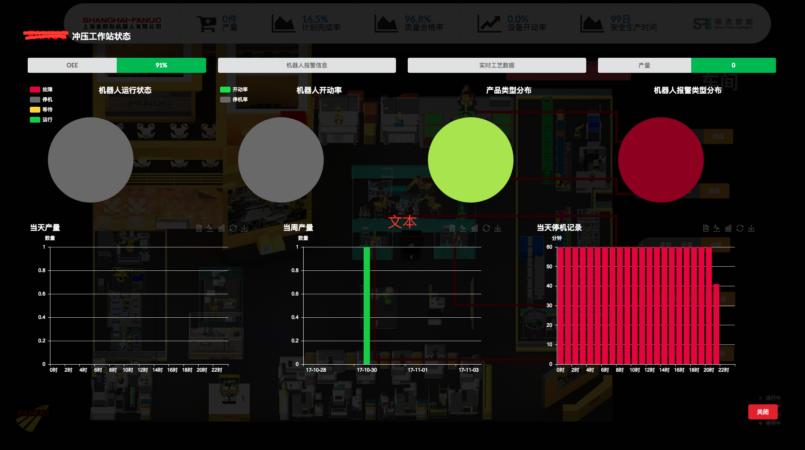

# SmartRobotPlant-PC-
FANUC RobotPlant System On React

[](https://github.com/facebook/react)
[](https://github.com/Semantic-Org/Semantic-UI-React)
[](https://github.com/ant-design/ant-design) 
[](https://github.com/hustcc/echarts-for-react)
[](http://opensource.org/licenses/MIT)
[](http://standardjs.com)

<!-- 演示地址 <> -->
## Demo截图




## 技术栈参考链接：

- React: http://www.react-cn.com/docs/getting-started.html
- React-router: https://github.com/ReactTraining/react-router
- Webpack: http://webpack.github.io/docs/
- Semantic-ui: http://react.semantic-ui.com/
- AntD: https://ant.design/docs/react/introduce-cn
- ES6: http://es6.ruanyifeng.com/

## 特性

-   基于[react](https://github.com/facebook/react)，[SemanticUIReact](https://github.com/Semantic-Org/Semantic-UI-React)，[echarts-for-react](https://github.com/hustcc/echarts-for-react) 工业机器人工厂车间看板实践。  
-   暂无响应式设计，1920*1080最佳。

## 更新日志


### 1.2

`2017-11-03`

-     去掉冗余代码尸体,可供参考上线

### 1.1

`2017-10-04`

-     根据项目需求,加写英文版,为翻专业名词,人肉手翻
-     完成mock假数据


## 开发构建

### 目录结构

```bash
├── /build/           # 项目输出目录
├── /public/        #公共文件，放html主入口
├── /src/            # 项目源码目录
│ ├── /components/   # UI组件及UI业务逻辑
│ │ ├── /charts/   # 图表组件
│ │ ├── /chartsEN/   # 图表组件英文版
│ │ ├── /fanucGMReport/  # GM看板层报表
│ │ ├── /fanucGMReportEN/  # GM看板层报表 英文版
│ │ ├── /fanucKanban/  # 车间看板层报表
│ │ │ ├── /cellModal/  # 车间看板层报表
│ │ │ │ │  ├── arcWelding.js  # 弧焊工作站实时组件
│ │ │ │ │  ├── gluing.js # 涂胶工作站实时组件
│ │ │ │ │  ├── sanding.js # 打磨工作站实时组件
│ │ │ │ │  ├── spotWelding.js  # 点焊工作站实时组件
│ │ │ │ │  └──stamping.js # 冲压工作站实时组件
│ │ │ │ ├── /modalSearch/  # 车间看板层报表
│ │ │ │ ├── cell.css  # 工作站组件css
│ │ │ │ ├── cell.js  # 工作站组件
│ │ │ │ └── index.css  # 车间看板入口组件css
│ │ │ └── index.js  # 车间看板入口组件
│ │ └── /fanucKanbanEN/  # 车间看板层报表  英文版
│ ├── /img/       # 图片资源
│ ├── /mock/       # 模拟数据文
│ ├── /utils/     # 全局工具目录
│ │ └── ajax.js  # 全局的ajax请求
│ ├── app.css       # 全局组件入口css
│ ├── app.js       # 全局组件入口js
│ ├── index.css       # 入口文件css样式
│ └── index.js       # 入口文件+路由配置
├── package.json     # 项目依赖资源信息
```

文件夹命名说明:

-   components：组件（方法）为单位以文件夹保存，文件夹名组件首字母小写（如`header`），方法首字母小写（如`layer`）,文件夹内主文件与文件夹同名，多文件以`index.js`导出对象（如`./src/components/header`）。

### 快速开始

克隆项目文件:

```bash
git clone https://github.com/rex19/SmartRobotPlant-PC-.git
```

进入目录安装依赖:

```bash
#开始前请确保没有安装roadhog、webpack到NPM全局目录
npm i 或者 yarn 
```

开发：

```bash
npm start / yarn start
打开 http://localhost:3000
```

构建：

```bash
npm run build

将会打包至build/目录 

```

## FAQ

  ```bash
    ....
  ```

